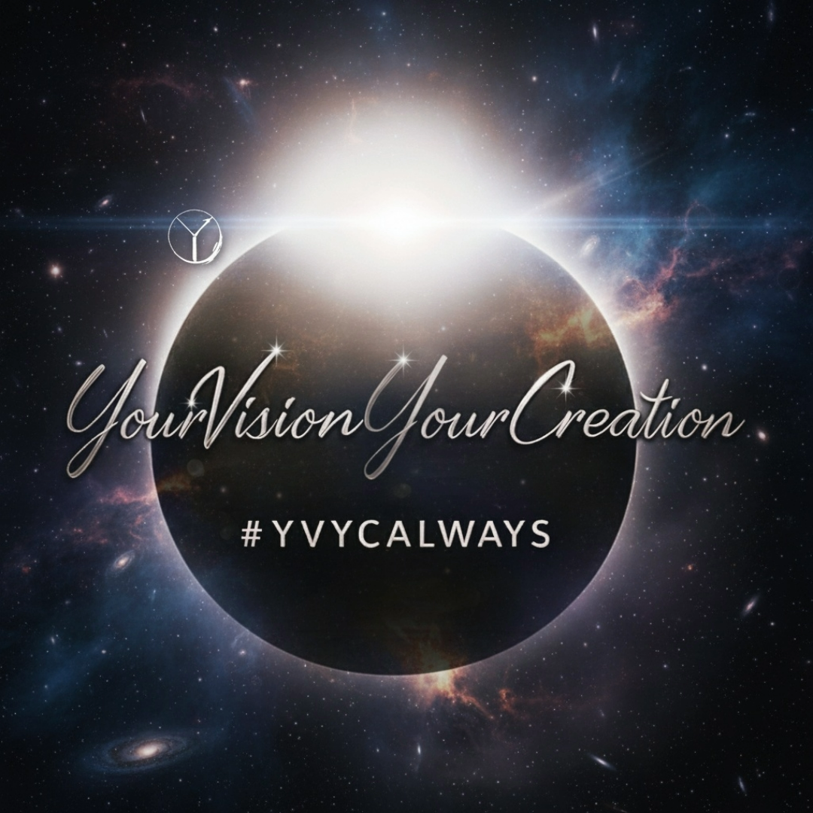

<p align="center">
  
</p>
# YVYC Claude Skills Library

**Your Vision Your Creation — Open AI Skill Repository**

---

## What Is This?

This is a free, open-source library of Claude AI skills — structured, ready-to-install prompt instructions that extend what Claude can do.

Every skill in this repo was curated, structured, and tested by **YVYC (Your Vision Your Creation)**. We take the best prompts shared publicly by creators across the internet and convert them into properly formatted Claude skills that you can install and use immediately.

No paywalls. No sign-ups. No conversion pressure. Just skills.

---

## Who Is This For?

- Claude users who want to get more out of their setup
- Builders and creators looking for ready-made skills
- Anyone who wants to skip the prompt engineering and get straight to results

---

## How To Use A Skill

1. Browse the category folders below
2. Open the skill folder you want
3. Read the `HOW-TO-USE.md` first — it explains what the skill does and how to activate it
4. Install the `SKILL.md` file into your Claude skills directory
5. Start using it

> **New to Claude skills?** Skills are instruction files that Claude reads to perform specialized tasks. You install them once and Claude activates them automatically when relevant.

---

## Library Structure

```
YVYC-Claude-Skills/
├── README.md
├── LICENSE
├── _templates/
│   ├── SKILL-template.md        ← blank skill template
│   └── HOW-TO-USE-template.md   ← blank how-to-use template
├── design/
│   └── [skill-name]/
│       ├── SKILL.md
│       └── HOW-TO-USE.md
├── marketing/
├── writing/
└── productivity/
```

---

## Categories

| Category | Description |
|---|---|
| `design/` | Visual identity, brand systems, content design, UI direction |
| `marketing/` | Copywriting, campaign strategy, social media, growth |
| `writing/` | Content creation, storytelling, editing, tone |
| `productivity/` | Workflows, planning, task management, systems |

---

## Skill Count

| Category | Skills |
|---|---|
| Design | 0 |
| Marketing | 0 |
| Writing | 0 |
| Productivity | 0 |
| **Total** | **0** |

> This table is updated with every new skill added.

---

## Credits & Attribution

Skills in this library are built on prompts shared publicly by creators across the internet. Where a prompt has a known original source, it is credited inside the individual `HOW-TO-USE.md` file.

The structuring, formatting, and skill architecture is original work by **YVYC**.

---

## License

This library is licensed under **Creative Commons Attribution 4.0 International (CC BY 4.0)**.

You are free to use, share, and adapt any skill in this repo — for personal or commercial purposes — as long as you give appropriate credit to **YVYC (Your Vision Your Creation)**.

[View full license →](./LICENSE)

---

## About YVYC

**Your Vision Your Creation** is an open ecosystem of tools, resources, and systems built to help creators, builders, and entrepreneurs move faster and think bigger.

[More at YVYC →](https://github.com/YourVisionYourCreation)
